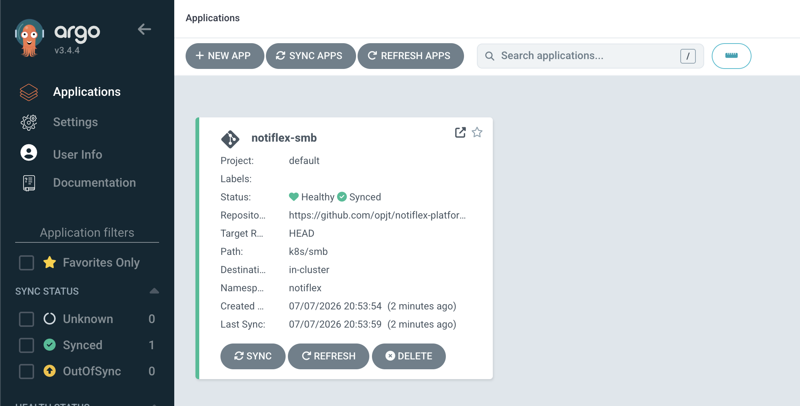

# CH03 - GitOps 도입

> 이 저장소는 「AI 시대에 개발자가 알아야 하는 인프라 구성 배포 with 클로드 코드」 책 스터디를 진행하며 정리한 내용을 다룹니다.

2장에서 클러드 코드를 통해 "빌드하고 배포해줘"로 쉽게 배포할 수 있다  
그럼에도 GitOps를 도입하는 이유는

- 깃 이력으로 현재 클러스터의 상태를 알 수 있음

`kubectl`로 직접 클러스터에 명령하는 것은 편리하지만 실행 후 흔적이 없다.  
반대로 선언형은 YAML을 고쳐애 해서 불편해보이지만, 최종 상태를 YAML을 통해서 확인하고 이것이 단일 진실 공급원이 된다.

- 누군가 급하게 kubectl edit 으로 프로덕션을 고치고 그 변경사항을 git에 올리지 않거나 관리하지 않으면 문제를 추적하기 어려움

## GitOps 도구 선택하기

책에서는 ArgoCD를 통해 GitOps를 구축하지만, ArgoCD 외에도 [Flux](https://github.com/fluxcd/flux2)와 종종 비교된다

Flux의 특징으로는 아래와 같다

- 완성된 하나의 CD 프로그램이 아니라 GitOps Toolkit에 가까움.
- 각 역할마다 컨트롤러가 분리되어 있고
  - source-controller: Git/Helm repo에서 데이터 가져오기
  - kustomize-controller / helm-controller: 실제 클러스터에 적용
  - 그 외 알림, 이미지 자동 업데이트 컨트롤러도 별도 존재
- 컨트롤러끼리는 직접 통신 안 하고, CRD 상태를 통해서만 느슨하게 연결됨
- CLI 제공

둘의 가장 큰 차이점은 ArgoCD는 웹 UI를 제공하다는 것이다.



## ArgoCD 설치하기

도구를 결정하였으니 설치를 진행한다.

> ArgoCD로 설치해줘.

정상적으로 설치되었는지 확안하기 위해 Argo웹에 접속한다

```bash
# 현재 비밀번호 조회
kubectl --context gke-sysnet4admin_book_gitaiops -n argocd get secret argocd-initial-admin-secret \
    -o jsonpath='{.data.password}' | base64 -d

# port forward
kubectl --context gke-sysnet4admin_book_gitaiops port-forward svc/argocd-server -n argocd 8443:443
```

웹으로 사용해도 되지만 CLI 명령어로 조작하기 위해 argocd-cli를 설치한다

```bash
brew install argocd
```

설치하고 나면 한번 인증을 수행한다.

```bash
$ argocd login localhost:8443 --insecure \
    --username admin \
    --password $(kubectl --context gke-sysnet4admin_book_gitaiops -n argocd get secret argocd-initial-admin-secret -o jsonpath='{.data.password}' | base64 -d)
'admin:login' logged in successfully
Context 'localhost:8443' updated

# 패스워드 변경 방법
$ argocd account update-password \
    --current-password $(kubectl --context gke-sysnet4admin_book_gitaiops -n argocd get secret argocd-initial-admin-secret -o jsonpath='{.data.password}' | base64 -d) \
    --new-password '변경비밀번호'
```

## Git 저장소 연결하기

ArgoCD에 레포지토리를 연결하여 GitOps를 구축한다.

ArgoCD에서는 Git -> 클러스터 연결을 `Application` 이라는 객체로 정의하여 관리한다.  
이 Git 경로를 감시하여 해당 클러스터에 배포해 라는 선언.

쿠버네티스 CRD로 만들어져 있기 때문에 YAML 하나로 관리할 수 있다

- Flux의 경우 감시하는 컨트롤러와 클러스터에 적용하는 컨트롤러가 나눠져있기 때문에 여러 YAML를 작성해야 함.

가드레일에 의해 `notiflex-smb.yaml` 파일이 생성되었다면 이때만 apply 명령형으로 클러스터에 적용하도록 한다.

syncPolicy는 git과 클러스터의 연동에 대한 정책 설정이다.

- automated: 자동 동기화
  - prune: Git repo에서 리소스가 삭제되면 클러스터에서도 리소스 삭제
  - selfHeal: kubectl edit 으로 리소스를 수정할 경우 되돌림

## git push로 배포까지

repo 까지 연결이 되었다면 정말 git push만으로 배포가 되는지 확인한다

notiflex 앱에 운영 중 지금 어떤 버전이 돌고 있는지 확인 가능하도록 `/version` API를 추가하고 배포해본다.

> API 버전 정보 확인할 수 있는 기능 추가하고 배포.

배포 흐름은 아래와 같다

- 신규 API 추가 (코드 수정)
- 신규 태그로 빌드 v0.1.1
- 매니페스트의 이미지 태그 수정 (0.1.0 -> 0.1.1)
- git push 이후 argocd가 변경사항 적용

지금은 argocd가 주기적으로 polling을 하며 상태를 비교하지만, github webhook을 사용하면 즉시 반응하도록 할 수도 있다

배포는 Rolling Update를 기본적으로 사용하는데 롤링 업데이트는 두 버전이 동시에 트래픽을 받는 순간이 생긴다.  
대부분의 문제에서는 상관없지만 API 하위 호환성이 깨지는 변경이라던가, DB 스키마가 변경되는 경우는 문제가 생긴다.

- 이 문제는 이후 챕터에서 해결한다

## github actions 적용

지금도 잘 작동하지만 매번 손으로 이미지를 빌드하고 버전 태그르 바꿔줘야하는 문제가 있다.

Github actions로 CI 파이프라인을 구축하여 빌드 과정을 자동화한다.

> 깃허브 액션 CI 만들어줘

- CI가 Artifact Registry에 접근하기 위해 GCP 서비스 계정을 생성
  - 필요한 최소 권한을 부여하기 위해 서비스 계정으로 분리한다
- Github Secrets에 인증 정보 등록
  - 서비스 계정의 key를 등록한다
- CI 워크플로우 yaml 작성

CI 인증방식은 key 방식 외에도 WIF(workload Identify Federation)이 좀더 권장되는 사항이지만 초기 설정이 좀더 복잡하기에 현재는 키방식을 사용한다.

- 왜 복잡한가? OIDC 토큰 발급 -> GCP에서 토큰 검증 -> 단기 토큰 발급 -> GCP 인증
  - OIDC provider를 구축해야 함(github가 생성한 토큰이 유효한지 판단)

CI 워크플로우를 살펴보면 v0.1.2 같은 [유의적 버전](https://semver.org/lang/ko/)을 사용하는 것이 아닌 SHA를 사용한다.

- git SHA는 커밋마다 생기는 고유 ID로 `git log <해시>` 를 통해 트래킹하기도 용이하다.
- 같은 커밋을 다시 빌드해도 같은 태그가 생성되어 멱등성이 보장됨

마지막으로 SHA 값을 매니페스트에 반영하는 것만 추가하면 된다.
