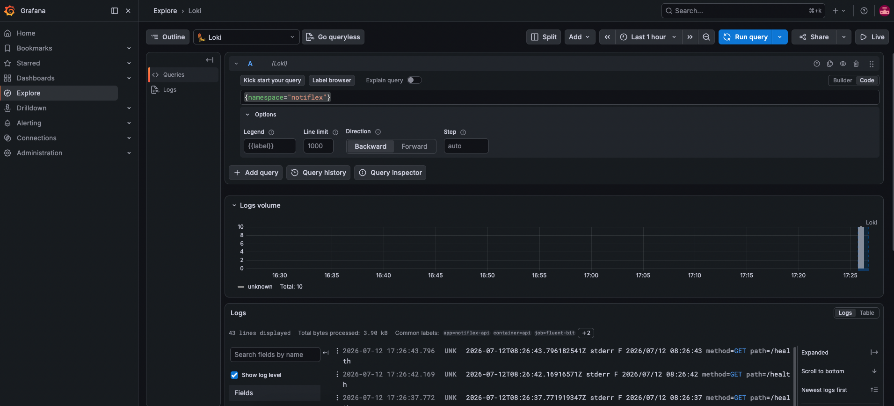
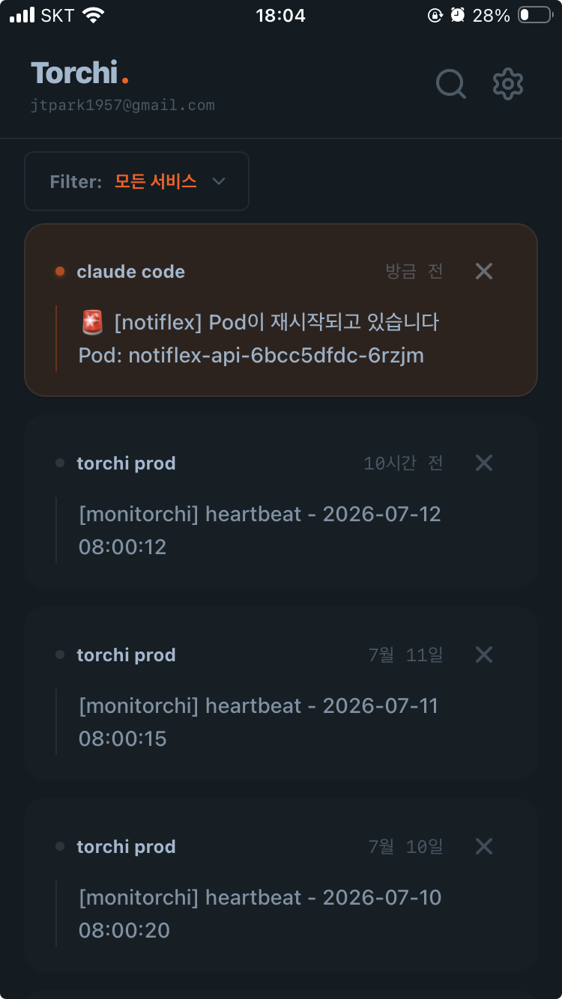

# CH04 - Observability

> 이 저장소는 「AI 시대에 개발자가 알아야 하는 인프라 구성 배포 with 클로드 코드」 책 스터디를 진행하며 정리한 내용을 다룹니다.

이번 챕터에서는 시스템의 눈이라고 할 수 있는 관측 가능성에 대해 구축한다.

관측 가능성(Observability)는 모니터링과 무슨 차이가 있나?

- 모니터링은 미리 정해놓은 지표를 감시하는 것

즉 알고 있는 문제를 빨리 발견하는 것이다.

관측가능성은 예상 못한 문제도 데이터를 통해 확인가능하게 하는 것으로, 시스템 내부 상태를 외부 데이터만으로 추론할 수 있게 하는 능력이다

**관측 가능성의 3대 요소**

- 메트릭: 지금 상태가 정상인지 비정상인지 판별할 수 있는 데이터
- 로그: 무슨일이 일어났는지 기록
- 트레이스: 하나의 요청이 시스템을 어떻게 지나갔는지 추적

본 챕터에서는 매트릭과 로그를 구축하고 알림을 더한다.

## 메트릭 모니터링

책 가드레일에서는 [prometheus](https://github.com/prometheus/prometheus) + [Grafana](https://github.com/grafana/grafana) 조합을 추천한다.

프로메테우스는 pull 기반으로 각 pod의 매트릭 정보를 수집하고 이 수집한 데이터를 보기 좋게 시각화 하는 것이 그라파나다

설치는 아래와 같이 진행한다

> 클러드코드야 설치를 부탁해

설치 진행 순서는 아래와 같다

- Helm Values 파일 작성 (리소스 최적화)
  - values 파일은 Helm으로 설치할 때 기본값을 덮어쓰는 설정 파일이다.
- monitoring 네임스페이스 생성 및 설치
- Pod 상태 확인
- 그라파나 UI 접속
- 프로메테우스 메트릭 수집 확인

설치 후에 Pod 상태를 확인한다

```bash
$ k get pods -n monitoring
NAME                                                     READY   STATUS    RESTARTS   AGE
alertmanager-kube-prometheus-kube-prome-alertmanager-0   2/2     Running   0          3m56s
kube-prometheus-grafana-6847d96988-2s4qq                 3/3     Running   0          4m5s
kube-prometheus-kube-prome-operator-7bf98957d8-66pnr     1/1     Running   0          4m5s
kube-prometheus-kube-state-metrics-5bcf856c4f-z2vdx      1/1     Running   0          4m5s
kube-prometheus-prometheus-node-exporter-4bqs4           1/1     Running   0          4m5s
kube-prometheus-prometheus-node-exporter-hksk6           1/1     Running   0          4m5s
prometheus-kube-prometheus-kube-prome-prometheus-0       2/2     Running   0          3m56s
```

Deployment의 경우 이름 끝에 랜덤 해시가 붙지만 `prometheus-kube-prometheus-kube-prome-prometheus-0` 같은 Pod는 Statefulset으로 PVC가 Pod에 고정돼서 재시작해도
같은 이름으로 이전 데이터를 유지한 상태로 생성된다.

- 수집한 매트릭 데이터를 영속적으로 저장해야하기 때문

그라파나에 접속하기 위해서는 port-forward로 연결한다. 초기 비밀번호는 helm-values 에서 설정한 값을 참고한다

- 로그인 시 기본 대시보드가 이미 포함되어 있는데 이는 kube-prometheus-stack이 설치 시 자동으로 만든 대시보드임

프로메테우스가 실제로 데이터를 잘 수집하고 있는지 확인하려면 마찬가지로 웹에 접근할 수 있다

- 프로메테우스는 기본적으로 인증(로그인페이지)가 없다. 원래 내부 인프라 도구로 설계돼서 클러스터 내부에서만 접근한다느 전제
- 그라파나는 여러 사람이 대시보드를 공유하는 용도라 계정 관리 기능이 들어가 있음

PromQL 이라는 전용 쿼리 언어로 데이터를 조회할 수 있다.

```promql
# Pod가 지금 몇 개 떠 있나
kube_pod_status_phase{namespace="notiflex", phase="Running"}

# Pod 재시작 횟수
kube_pod_container_status_restarts_total{namespace="notiflex"}

# notiflex Pod CPU 사용률
rate(container_cpu_usage_seconds_total{namespace="notiflex", container="api"}[5m])

# notiflex Pod 메모리 사용량 (bytes)
container_memory_working_set_bytes{namespace="notiflex", container="api"}

# 노드별 CPU 사용률 (%)
100 - (avg by(instance) (rate(node_cpu_seconds_total{mode="idle"}[5m])) * 100)

# 노드별 메모리 사용률 (%)
100 - (node_memory_MemAvailable_bytes / node_memory_MemTotal_bytes * 100)

# 클러스터 전체 Pod 수
count(kube_pod_status_phase{phase="Running"}) by (namespace)
```

- 그라파나 대시보드에서 보는 그래프가 내부적으론 이 PromQL을 실행한 결과물을 포장하는 것임

## 로그 수집 구축

메트릭으로 에러가 발생했다 정도는 알 수 있어도 어떤 에러인지는 알 수 없다

- Pod 로그를 보려면 kubectl logs를 직접 실행해야 하고, Pod가 재시작되면 이전 로그가 사라진다

책에서는 메모리 사용량이 적고 Grafana와 통합할 수 있는 Loki + Fluent Bit 조합을 추천한다.

Loki가 하는 일은 Fluent Bit이 보내주는 로그를 받아서 저장하는 역할을 하고, Grafana에서 조회 요청이 오면 검색해서 응답한다

- 엘라스틱서치와 다른 점은, 로그 내용 전체를 인덱싱하지 않고 라벨 기반으로 인덱싱 하여 저장 공간을 낮춘다.
  - namespace,pod,container 같은 메타데이터만 인덱싱하는 것이 라벨 기반 인덱싱이다.

설치는 아래와 같이 진행한다.

> Loki + Fluent Bit 설치해줘

- Loki Helm values 작성 (리소스 최적화)
- Loki 설치
- Fluent Bit Helm values 작성
- Fluent Bit 설치
- Grafana에서 로그 조회 확인

Loki를 설치할 때 싱글바이너리 모드로 설치한다

- Loki는 여러 컴포넌트를 마이크로서비스 형태로 배포할 수 있다 (각 컴포넌트를 독립적으로 스케일링할 때 사용, 운영환경)

설치가 끝났으면 로그가 실제로 들어오고 있는지 그라파나에서 확인한다.

- 현재 notiflex에 로그를 남기는 코드가 없기 때문에 앱의 로그를 보고싶다면 코드를 추가해야함.



## 알림 설정

대시보드를 24시간 지켜볼 수는 없으니 문제가 생기면 자동으로 알려주는 알림을 설정한다.

kube-prometheus-stack 을 설치할 때 Alertmanager가 이미 포함되어 있다.

알림 조건을 PrometheusRule 로 설정하면 프로메테우스가 조건을 감시하고 알럿매니저가 알림을 전송한다

- 알림 규칙을 YAML파일로 작성하여 이력관리가 가능함
- 그라파나에도 알림 기능이 내장되어 있지만 Grafana DB에 저장하는 방식이라 룰관리가 어려움.

### 규칙 생성

일반적으로 slack으로 알림을 받지만 내가 만든 알림 서비스인 [torchi](https://torchi.app)을 통해 알림을 받도록 설정한다.

torchi는 curl 한줄로 PUSH 알림을 받을 수 있는 서비스이다.

```bash
curl "https://torchi.app/api/v1/push/토큰" \
  -d '안녕하세요!'
```

위 같은 커스텀 HTTP 서비스는 Alertmanager가 지원하지 않기 때문에 보기 편하게 위해서는 중간 어댑터가 필요하다.

- 어댑터는 단순하기 Alertmanager JSON을 읽어서 보기좋게 파싱해주는 역할이다

**핵심 코드 (Go, ~50줄)**

```go
  // Alertmanager가 보내는 JSON 파싱
  var payload Payload
  json.Unmarshal(body, &payload)

  // 메시지 포맷팅
  icon := "🚨"
  if alert.Status == "resolved" { icon = "✅" }
  msg := fmt.Sprintf("%s [%s] %s\nPod: %s", icon, namespace, summary, pod)

  // 커스텀 서비스로 전송
  http.Post(torchiURL, "text/plain", bytes.NewBufferString(msg))
```

alertmanager가 토치로 알림을 보낼 수 있게 config을 수정한다

```yaml
alertmanager:
  config:
    global:
      resolve_timeout: 5m # 조건이 해소됐을 때 resolved 처리 간격
    receivers:
      - name: "default"
      - name: "torchi"
        webhook_configs:
          - url: "http://webhook-bridge.monitoring.svc.cluster.local:8080/webhook"
    route:
      group_by: ["alertname", "namespace"]
      group_wait: 30s # 같은 그룹 알림을 해당 시간동안 모아서 한번에 발송
      group_interval: 5m # 같은 그룹에서 새 알림 추가 시 재발송
      repeat_interval: 12h # 같은 알림이 계속 firing 중이면 반복 알림
      receiver: "default"
      routes:
        - receiver: "torchi"
          matchers:
            - namespace =~ "notiflex"
```

이제 알림을 보내는 규칙을 선언한다.

#### 핵심: expr + for 조합

```yaml
# 재시작 감지 — 10분 내 1번이라도 재시작하면 즉시 발화
expr: increase(kube_pod_container_status_restarts_total{namespace="notiflex"}[10m]) > 0
for: 0m

# Not Ready 감지 — 2분 이상 지속될 때만 발화 (순간적인 재시작 노이즈 제거)
expr: kube_pod_status_ready{namespace="notiflex", condition="false"} > 0
for: 2m

- increase(...[10m]) — 10분 구간 동안의 증가량
- for: 0m — 조건 충족 즉시 발화
- for: 2m — 2분 지속 후 발화 (플래핑 방지)
```

**주의**

labels: release: kube-prometheus 없으면 Prometheus가 이 규칙을 로드하지 않는다.  
Helm으로 설치한 kube-prometheus-stack은 이 레이블로 PrometheusRule을 필터링한다.

정상적으로 설정됐다면 컨테이너를 강제 크래시하여 알림이 오는지 확인할 수 있다.

```bash
kubectl debug -it notiflex-api-6bcc5dfdc-6rzjm \
    -n notiflex --image=busybox --target=api \
    -- sh -c "kill 1"
```

- notiflex-api는 스크래치 이미지라 kill명령이 없음
- 그래서 busybox를 애피머럴 컨테이너로 붙여서 실행
- kubectl delete로 Pod를 삭제하는 것은 Pod 자체를 없애고 새 Pod를 만들기 때문에 restarts 수가 0부터 시작한다.
- kill 1 시나리오의 경우 같은 Pod안에서 재시작되기 때문에 Pod의 restarts 카운트가 증가함


