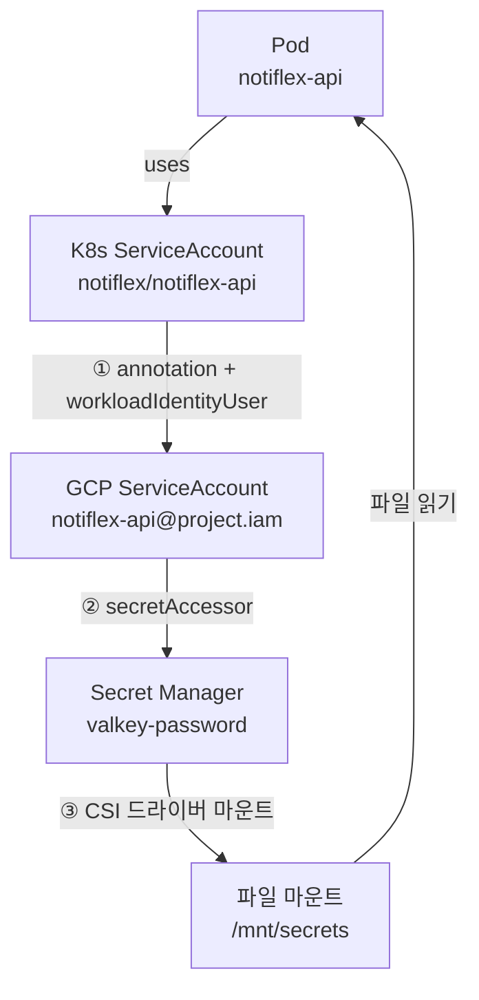
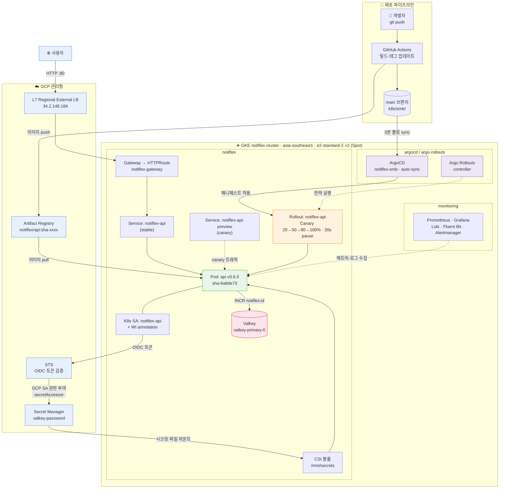

# CH06 - 엔터프라이즈를 위한 기반 재정비

> 이 저장소는 「AI 시대에 개발자가 알아야 하는 인프라 구성 배포 with 클로드 코드」 책 스터디를 진행하며 정리한 내용을 다룹니다.

## Pod 간 상태 공유

현재 Notiflex의 `/id` 엔드포인트는 인메모리를 사용하여 카운터 정보를 업데이트 한다  
Pod가 1개일 때는 문제가 없지만, 2개 이상이되면 각 Pod간 독립적인 카운터를 지니게 됨.

Pod간 상태를 공유하기위한 캐시 도구를 도입한다

일반적으로 캐시를 생각하면 떠오르는 대표 도구가 `Redis`와 `Memcached`가 있는데 이번 실습에서는 `Valkey`를 선택한다.

- Redis는 SSPL 라이센스로 오픈소스가 아님
- Valkey는 Redis의 Fork 버전으로 라이선스로서 자유로움
- Memcached는 영속성이 없는 순수캐시라 재시작 시 데이터가 전부 날아감

```go
// 기존 코드
id := counter.Add(1)
// 수정된 코드
result, err := valkeyClient.Do(context.Background(),
    valkeyClient.B().Incr().Key("notiflex:id").Build(),
).AsInt64()
if err != nil {
    http.Error(w, "Valkey error", http.StatusInternalServerError)
    return
}
```

코드를 위와 같이 수정하여 카운터 위치를 Pod 메모리에서 -> Valkey 중앙을 바라보게 함

- `B()`빌더패턴, Incr(Increment)로 숫자값을 1증가 시킨 값을 리턴받음

Valkey에 접근하기 위하여 시크릿값을 환경변수에서 읽고 Pod 시작 시 Valkey가 아직 준비가 되지 않았을 경우를 대비하여 재시도 로직도 추가하였다.

- 물론 재시도 로직을 추가하지 않고, Valkey 연결을 실패할 경우 종료하게 한다면 K8s가 Pod를 재시작하였을 것임
  - K8s는 Pod가 반복적로로 으로 죽으면 재시작 간격을 점차 늘림 (CrashLoopBackOff)

<!-- Helm으로 설치하면 ArgoCD가 모르는 리소스가 되어 클러스터 재생성 시 Valkey를 다시 설치해줘야 한다. -->

## 시크릿 관리

Valkey를 클러스터에 추가하니 notiflex서비스에서 접속하기 위한 패스워드를 관리해야 현재 K8s Secret으로 관리하고 있다.

K8s Secret은 base64 인코딩으로 암호화가 아니기 때문에 누구나 평문으로 확인할 수 있다.

프로덕션 수준의 시크릿 관리를 하기 위해서는 보통 외부 KMS(키매니지먼트서비스)를 이용하는데 이번 실습에서는 `Google Secret Manager`를 사용한다

- Workload Identity를 설정하면 GCP IAM으로 연결되어 키 없이도 인증 가능
  - Pod가 GCP 리소스에 접근할 때 OIDC 토큰을 자동으로 발급받음.(키 x)
- serviceaccount 리소스를 통해 클러스터 자체가 신원 증명 역할을 하게함.

Pod가 시크릿 매니저의 데이터에 접근하기 위해서는 Secrets Store CSI(Contaienr Storage Interface) Addon이 필요하다

- 원래는 컨테이너가 스토리지에 접근하기 위한 표준 인터페이스인데, 시크릿 매니저의 시크릿 데이터도 파일처럼 마운트할 수 있게 함

```bash
gcloud container clusters update notiflex-cluster --enable-secret-manager
```

이 명령어 하나로

- csi-secrets-store-gke: secrets-store CSI 드라이버 (DaemonSet)
- csi-secrets-store-provider-gke: GCP Secret Manager 프로바이더 (DaemonSet)

둘다 설치함

드라이버와 프로바이더가 분리된 이유는 드라이버는 공통영역으로, 프로바이더만 교체 가능하도록 하기 위해서다  
만약 aws나 하시코프 볼트를 사용하는 경우 프로바이더만 교체해서 사용하면 됨

### IAM 서비스 계정 바인딩



**1. K8s SA에 annotation 추가**

```yaml
# K8s SA에 "나는 이 GCP SA와 연결돼있어" 선언
apiVersion: v1
kind: ServiceAccount
metadata:
  name: notiflex-api
  namespace: notiflex
  annotations:
    iam.gke.io/gcp-service-account: notiflex-api@opjt-gitaiops-project.iam.gserviceaccount.com
```

**2. GCP SA에 "이 K8s SA가 나를 사용할 수 있어" 허용**

```bash
gcloud iam service-accounts add-iam-policy-binding \
  notiflex-api@opjt-gitaiops-project.iam.gserviceaccount.com \
  --member="serviceAccount:opjt-gitaiops-project.svc.id.goog[notiflex/notiflex-api]" \
  --role="roles/iam.workloadIdentityUser"
```

양방향 선언이 필요함, K8s SA는 "나는 저 GCP SA야", GCP SA는 "저 K8s SA가 나를 쓸 수 있어". 둘 다 있어야 연결된다.

**3. GCP SA에 Secret 접근 권한**

```bash
gcloud secrets add-iam-policy-binding valkey-password \
  --member="serviceAccount:notiflex-api@opjt-gitaiops-project.iam.gserviceaccount.com" \
  --role="roles/secretmanager.secretAccessor"
```

**4. Pod이 이 K8s SA를 사용하도록 지정**

```yaml
# rollout.yaml
spec:
  template:
    spec:
      serviceAccountName: notiflex-api # 이게 없으면 default SA 사용
```

### notiflex 시크릿 조회 수정

```go
// 기존 코드
password := os.Getenv("VALKEY_PASSWORD")
// 추가된 코드
if pwFile := os.Getenv("VALKEY_PASSWORD_FILE"); pwFile != "" {
  if data, err := os.ReadFile(pwFile); err == nil {
    password = string(data)
  }
}
```

이제 시크릿값을 scret-csi-store 에드온으로 파일에서 읽을 수 있게 되었다

### Canary 배포

전챕터에서 블루/그린 배포를 도입하였다, 블루 그린은 새버전을 띄운 후 한 번에 전환한다.  
카나리 배포는 새 버전에 트래픽을 조금씩 보내면서 문제가 생기더라도 소수의 사용자만 영향 받고 즉시 롤백할 수 있게한다.

- 운영 환경에서 pod가 수십 개가 되면 blue/green의 운영 비용이 커짐
  - replicas가 5라고 하면 blue/green의 경우 5/5 로 10개의 pod가 준비되어야함
  - 반면 카나리는 20%만 미리 적용한다고 할 경우 4/1 로 5개의 pod만 있어도됨

이미 기존에 설치한 Argo Rollouts에서 특정 필드만 수정하면 되니 추가 도구 설치가 필요없고, 리소스도 효율적이다.

```yaml
# rollout.yaml 수정
strategy:
  canary:
    canaryService: notiflex-api-preview
    stableService: notiflex-api
    steps:
      - setWeight: 20
      - pause: { duration: 30s }
      - setWeight: 50
      - pause: { duration: 30s }
      - setWeight: 80
      - pause: { duration: 30s }
```

카나리 배포가 정상적으로 동작하는지 테스트하기 위해 버전을 변경하고 push한다.

```bash
$ kubectl argo rollouts get rollout notiflex-api -n notiflex
Name:            notiflex-api
Namespace:       notiflex
Status:          ॥ Paused
Message:         CanaryPauseStep
Strategy:        Canary
  Step:          3/6
  SetWeight:     50
  ActualWeight:  50
Images:          asia-southeast1-docker.pkg.dev/opjt-gitaiops-project/notiflex/api:sha-6a8de73 (canary)
                 asia-southeast1-docker.pkg.dev/opjt-gitaiops-project/notiflex/api:sha-f04b261 (stable)
Replicas:
  Desired:       1
  Current:       2
  Updated:       1
  Ready:         2
  Available:     2

NAME                                      KIND        STATUS     AGE    INFO
⟳ notiflex-api                            Rollout     ॥ Paused   5m48s
├──# revision:2
│  └──⧉ notiflex-api-594485b98f           ReplicaSet  ✔ Healthy  72s    canary
│     └──□ notiflex-api-594485b98f-xkg26  Pod         ✔ Running  71s    ready:1/1
└──# revision:1
   └──⧉ notiflex-api-7c589c5df4           ReplicaSet  ✔ Healthy  5m48s  stable
      └──□ notiflex-api-7c589c5df4-bqvsh  Pod         ✔ Running  5m47s  ready:1/1
```

위처럼 카나리 배포가 진행되는 걸 확인할 수 있다.

> 20% → 30초 → 50% → 30초 → 80% → 30초 → 100% 순서로 점진적으로 트래픽이 이동했고, 이제 sha-6a8de73 (v0.6.0)이 stable로 승격됐습니다.

만약 카나리 배포중 에러가 발생하면

`kubectl argo rollouts abort` 로 즉시 중단하고 stable로 복원한다.  
프로덕션에서는 매번 사람이 몬티ㅓ링하는 대신 프로메테우스 매트릭(에러율,응답시간)을 각 단계에서 측정하여 기준치 초과 시 자동으로 abort하는 자동화가 핵심이다.

### 마무리

지금 시스템이 어떤 모양인지 보여주는 그림을 기록한다.  
사람과 AI가 같은 그림을 보고 시작할 수 있도록 현재 아키텍처를 한 군데에 정리한다.

- [claude-context/architecture.md](https://github.com/opjt/notiflex-platform/blob/7a38ec3344dd33c80754efe29a8cfcca1b96b8a9/claude-context/architecture.md)

위 .md 파일을 통해 보기좋게 mermaid로 그려달라고 하여 시각화할 수도 있다  
mermaid는 md파일과 통합된다는 점이 장점인데 그럴 필요가 없다면 요즘은 html로 그려주는게 더 보기 편한 것 같다


