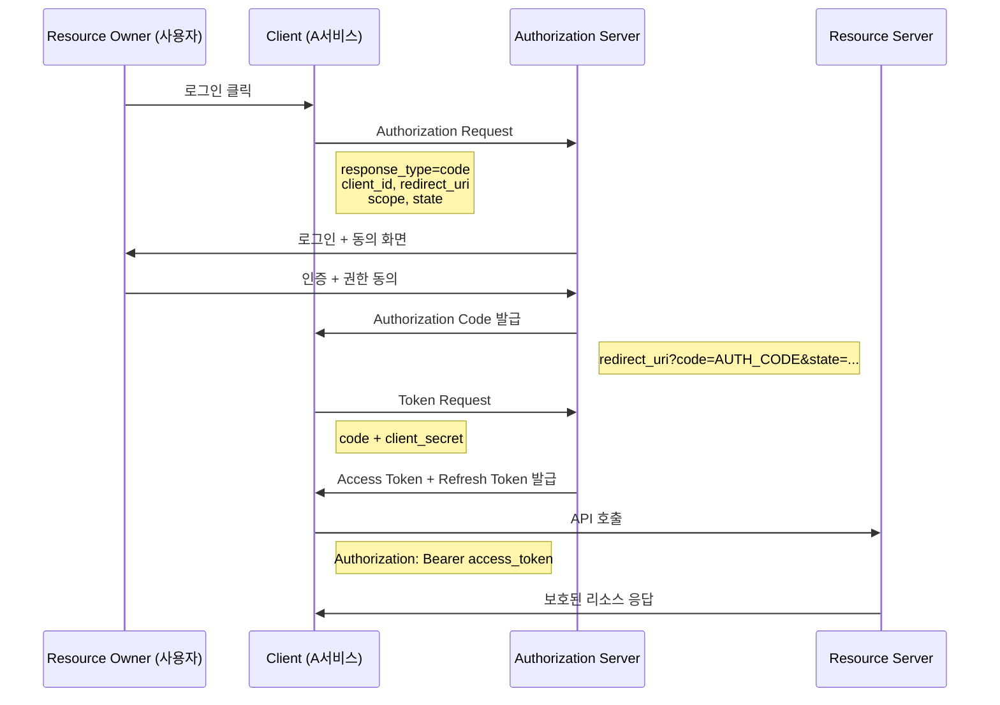

# OAuth

> OAuth는 권한 위임(Authorization)를 위한 개방형 표준 프로토콜이다.

**[관련 spec]**

- [RFC 5849](https://datatracker.ietf.org/doc/html/rfc5849) - The OAuth 1.0 Protocol
- [RFC 6749](https://datatracker.ietf.org/doc/html/rfc6749) - The OAuth 2.0 Authorization Framework

## 왜 필요한가?

OAuth가 없던 시절에는 어떻게 하였나

먼저 이해하기 쉽게,

A 서비스에서 사용자의 구글 드라이브 접근권한이 필요하다고 가정해보자

- 사용자가 A서비스에 구글 패스워드를 직접 입력함
- 이후 A서비스가 -> 구글 API를 호출

A서비스가 사용자의 패스워드를 알게 됨, A서비스를 신뢰해야하고 A가 털리면 내 정보도 털리게 됨

OAuth가 해주는 것.

- 사용자 -> 구글한테만 비밀번호 입력 (A서비스는 개입 못 함)
- A서비스는 구글 드라이브 API만 호출 가능한 토큰을 받음 (패스워드는 모름)

A서비스가 털려도 token만 털림, token은 패스워드와 다르게 권한의 scope가 있고 + 만료 기간이 존재

이거에 대한 표준이 OAuth인 것이다

## Oauth 2.0

OAuth 1.0의 문제점을 보완하기 위해 나온 것이 OAuth 2.0 이다

OAuth 프레임웤을 이해하기 위해선 아래 개념에 대해 살펴본다

- Resource Owner: 사용자
- Client: 사용자의 정보에 접근하는 제3자 서비스(A서비스)
- Authorization Server: 토큰 발급 서버 (Client의 접근을 관리하는 서버)
- Resource Server: 보호된 API 서버 (Resource Owner의 데이터를 관리하는 서버)

  2.0버전은 1.0버전과 다르게 Grant 방식이 여러개가 있음.

### Authorization Code Flow

RFC 스펙을 살펴보면 Client는 두종류로 나뉨

**confidential**: credential을 안전하게 보관할 수 있는 Client (백엔드 서버가 있는 환경)  
**public**: 보관 못 하는 Client (설치형 앱, 브라우저 앱)

위의 flow는 **confidentail**의 경우이고, **public**의 경우 `client_secret`이 노출되기 때문에 인증이 되지 못함  
그래서 스펙에서 public client에게 secret 기반 인증을 요구하지 않음

<!-- 그럼 public client는 어떻게 챌린지하냐? : PKCE -->
